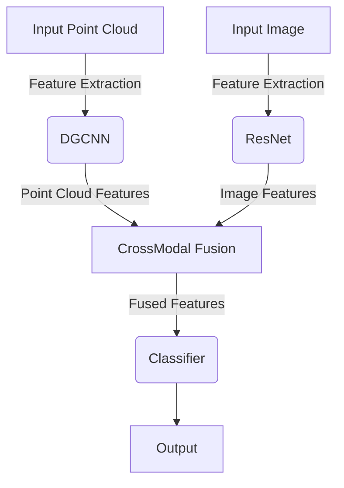

# CrossPoint on ModelNet40

## Overview

This repository provides a simple implementation of the CrossPoint model on the ModelNet40 dataset. CrossPoint is a cross-modal 3D point cloud recognition framework that leverages both point cloud and image data for enhanced performance. This implementation is inspired by the repository [MohamedAfham/CrossPoint](https://github.com/MohamedAfham/CrossPoint) and includes extensive Chinese comments to facilitate understanding.


这个仓库提供了CrossPoint模型在ModelNet40数据集上的一个简单实现。CrossPoint是一个跨模态的3D点云识别框架，它利用点云和图像数据来提升性能。这个实现受到了仓库MohamedAfham/CrossPoint的启发，并且包含了大量的中文注释以便于理解。

## Key Features

- Implementation of the DGCNN model for point cloud processing.
- Integration of ResNet for image feature extraction.
- Support for both training and testing on the ModelNet40 dataset.
- Extensive Chinese comments for better code comprehension.

## Getting Started

### Prerequisites

Before you begin, ensure you have met the following requirements:

- Python 3.x
- PyTorch 1.x
- CUDA (if using GPU)
- NumPy
- H5Py
- Matplotlib (for visualization)

You can install the required Python packages using pip:

```bash
pip install torch torchvision numpy h5py matplotlib
```


### Usage

To train the model, run the following command:

```bash
python train_crosspoint.py
```

This will start the training process with default parameters. You can adjust the parameters by modifying the `args` in the `train_crosspoint.py` script.

## Code Structure

Here's an overview of the code structure and key components:

```
CrossPoint-ModelNet40/
│
├── data/                 # Data loading and preprocessing
│   ├── __init__.py
│   ├── data.py
│   ├── data_utils.py
│   └── shapenet_part.py
│
├── models/               # Model architectures
│   ├── DGCNN_pc.py
│   ├── Resnet_img.py
│   └── shapenet_part.py
│
├── train_crosspoint.py   # Training script
├── util.py               # Utility functions
└── README.md             # This file
```

### Data Loading and Preprocessing

- `data.py`: Handles data loading for point clouds and images.
- `data_utils.py`: Provides utility functions for data augmentation and normalization.
- `shapenet_part.py`: Loads and processes the ShapeNet part dataset.

### Model Architectures

- `DGCNN_pc.py`: Defines the DGCNN model for point cloud processing.
- `Resnet_img.py`: Defines the ResNet model for image feature extraction.

### Training Script

- `train_crosspoint.py`: Main script for training the CrossPoint model.

### Utility Functions

- `util.py`: Contains utility functions for training, such as learning rate scheduling and logging.

## Visualization

Below is a diagram illustrating the CrossPoint model architecture:



## Acknowledgements

This implementation is inspired by the work in the repository [MohamedAfham/CrossPoint](https://github.com/MohamedAfham/CrossPoint). We would like to express our gratitude for their contribution to the field.

## License

This project is licensed under the MIT License - see the [LICENSE](LICENSE) file for details.

---

Feel free to explore the code, modify it, and use it as a starting point for your own projects. If you have any questions or need further clarification, don't hesitate to reach out.
